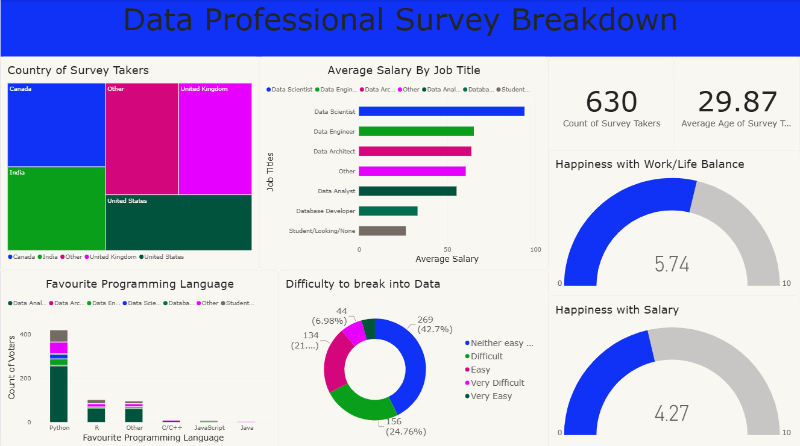

# Data Professional Survey Analysis | Power BI

## 📊 Project Overview

This project presents an interactive Power BI dashboard built using a Data Professional Survey dataset.

The dashboard explores different aspects of the data profession, including professional roles, salaries, programming language preferences, career entry difficulty, salary satisfaction, and work-life balance.

## 🎯 Business Questions

The dashboard was designed to answer questions such as:

- What are the most common roles among respondents?
- How does average salary vary across different roles?
- Which programming languages are preferred across different roles?
- How difficult is it for professionals to enter the data field?
- How satisfied are professionals with their salaries?
- How do professionals rate their work-life balance?
- How are respondents distributed across different countries?

## 🛠️ Tools & Technologies

- Power BI
- Power Query
- DAX
- Data Visualization
- Data Transformation
- Data Modeling

## 📈 Power BI Skills Demonstrated

- Data cleaning and transformation using Power Query
- Data analysis using DAX
- KPI creation
- Interactive visualizations
- Slicers and filtering
- Conditional formatting
- Hierarchies and drill-down
- Data modeling
- Dashboard design

## 📷 Dashboard Preview



## 📁 Project Structure

```text
Data-Professional-Survey-PowerBI-Dashboard/
│
├── PowerBI/
│   └── Data-Professional-Survey-Dashboard.pbix
│
├── Screenshots/
│   └── dashboard-overview.png
│
└── README.md
